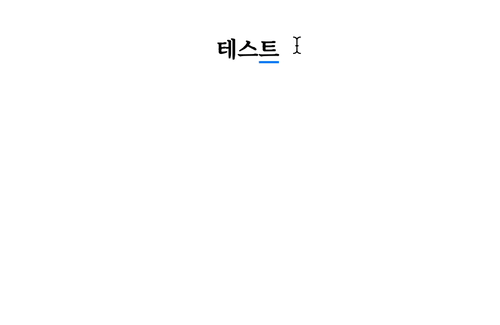

개인적으로 만드는 글짓기 서비스 프로젝트에서 제목 영역에서 엔터를 입력했을 때, 포커스가 본문 영역으로 이동했어야 했다. 그래서 키 이벤트에서 해당 노드에 대해 `blur` 처리를 한 뒤 본문 영역 노드에 `focus` 처리를 해주었다. 그런데, 다음과 같은 문제가 발생했다.



한글은 기본적으로 Composition(조합)이 입력 중 반드시 일어나는 문자 체계이다. Composition은 말 그대로 한 문자를 작성하는 데 한 번 누르는 걸로 끝나는 것이 아니라, 여러 입력이 조합되어 한 문자를 완성시키는 동작이다. 한글만이 아니라 `´`+`e` = `é`와 같은 글자를 입력할 때도 필요하다.

## 문제 상황

Composition 중 focus에 변화가 생기면 위와 같이 조합 중이던 문자가 중복으로 입력되게 된다. Chrome에서 이러한 문제가 발생했고, 혹시 몰라 Safari에서 다시 시도해보니 문제가 없었다.

이런저런 실험을 해 본 결과, `focus` 동작 시에 이런 문제가 발생하는 듯 했다. (심지어 이미 포커스 받고 있는 인풋에 다시 포커스를 요청해도 중복으로 입력되었다!)

## 해결 시도

#### Chrome의 버그

Chrome에서만 발생하니, Chrome의 버그로 생각하고 열심히 찾아보았다. 다음과 같은 [비슷한 사례](https://issues.chromium.org/issues/40762477)들이 보고 되어 있었는데, 올해 초에 고쳐진 것으로 표시가 되어 있었다. 윈도에서만 고쳐진 걸까..? 싶어서 더 많이 찾아봤는데 이렇다 할 해결책을 찾을 수 없었다 :(

#### 일단 해결하는 법?

당장 해결하는 법이 없을까? 고민하다 문득 `setTimeout(..., 0)` Hack이 떠올랐다. 이는 작업을 당장 실행하지 않고 메시지 큐로 넘기기 때문에 많은 문제들이 해결된다.

그래서 한 번 다음과 같이 바꿔 보았고,

```ts
if (ev.nativeEvent.isComposing) {
	setTimeout(() => void editorElement.focus(), 0);
} else {
	editorElement.focus();
}
```

일단, 문제는 해결되었다.

이와 관련해서 계속 연구하고 고찰해 이 글에 수정해보고자 한다.