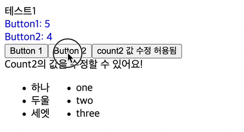

[이전 글](./react-hooks-mg-1)에서 리액트의 훅이 어떻게 동작하는지 살펴보았어요.

이번 글에서는 이 원리를 기반으로 naïve한 구현을 해볼까 해요.

### 훅의 데이터를 저장합시다.

리액트에서는 전역변수로 현재 작업 중인 훅에 대한 정보를 저장해 구현했었어요. 저도 이런 식의 접근을 해보았어요. 단, 저는 모듈을 나누어 작업했기 때문에 단순한 전역변수보다는, 싱글톤 패턴과 비슷하게 `RenderContext`라는 객체로 감싼 다음 사용했어요.

```ts
export type Hook<T> = { current: T; deps?: unknown[] };

interface IRenderContext {
  currentHooks: Hook<unknown>[];
  currentHookIndex: number;
  invalidateCurrentComponent: (() => void) | null;
}

export const RenderContext: IRenderContext = {
  currentHooks: [],
  currentHookIndex: 0,
  invalidateCurrentComponent: null,
};
```

### 렌더링 시, 컴포넌트 함수 호출 전에 적절한 `RenderContext`를 제공해야겠네요.

```ts
function renderElement(vnode: MyNode) {
  // ...
  RenderContext.invalidateCurrentComponent = () => renderNode(vnode, container, root);
  
  while (isComponentElement(vnode)) {
    const key = generateKey(vnode);
    const Component = vnode.type;
    
    // 현재 함수의 훅들
    RenderContext.currentHookIndex = 0;
    RenderContext.currentHooks = nodeData.hooks?.get(key) || [];
  
    vnode = Component(vnode.props);
  
    // 업데이트
    if (!nodeData.hooks) nodeData.hooks = new Map();
    nodeData.hooks?.set(key, RenderContext.currentHooks);
  }
  // ...
}
```

위와 같이, 컴포넌트 함수를 호출하기 전, 훅 데이터를 적절히 연결해주고 인덱스도 0으로 초기화해줬어요. 이렇게 함으로써, 각 컴포넌트 함수 안에서 사용되는 훅 함수마다 적절하게 훅 데이터를 찾아갈 수 있겠죠?

컴포넌트 함수의 코드를 모두 실행한 후엔, 변화된 훅 데이터를 저장해주도록 합시다! 잠깐, 그런데 어디에 저장해야 하는 거죠?

### 훅의 데이터를 컴포넌트와 연결합시다.

리액트에서는 Fiber Node에 훅의 데이터를 저장했었어요. 음… 그렇다면 Fiber Node를 도입해야 하는 걸까요? 뭔가 일이 너무 커지는 느낌입니다. Fiber, 가상 DOM까지 도입하기엔 너무 일이 커지니, 실제 DOM에 직접 저장해봅시다! 실제 DOM 노드도 js 객체이기 때문에 커스텀 속성을 부여할 수 있어요.

```ts
function renderElement(vnode: MyNode) {
  const nodeData = container.$$ || (container.$$ = {});

  // ... 앞선 코드를 실행할게요 ...

  node.$$ = { ...existingNode?.$$ };
}
```

### 훅 데이터에 순서대로 접근합시다.

```ts
function _getHook<T>(): Hook<T> | null {
  const hook = RenderContext.currentHooks[RenderContext.currentHookIndex];
  return hook as Hook<T> | null;
}
function _createHook<T>(value: T): Hook<T> {
  const newHook: Hook<T> = { current: value };
  RenderContext.currentHooks.push(newHook);

  return newHook;
}
function createOrGetHook<T>(initValue: () => T) {
  const hook = _getHook<T>() || _createHook<T>(initValue());
  return hook;
}
function consumeHook() {
  RenderContext.currentHookIndex++;
}
```

개인적인 선호에 따라 `createOrGetHook` 함수와 `consumeHook`을 합칠 수 있을 것 같네요. 저는 사용하는 측에서 다음 Hook으로 넘어감을 명시적으로 나타내는 게 더 좋을 것 같아 별도로 나누겠습니다.

```ts
export function useState<S>(initialState: (() => S) | S) {
  const hook = createOrGetHook(ensureFunction(initialState));
  consumeHook();

  const updater = RenderContext.invalidateCurrentComponent;

  const setState: Dispatch<SetStateAction<S>> = (action) => {
    const prevState = hook.current;
    const newState = typeof action === "function" ? (action as (prevState: S) => S)(prevState) : action;

    hook.current = newState;
    updater?.();
  };

  return [hook.current, setState] as const;
}
```

자, 이런 식으로 하면 `RenderContext` 안의 각 데이터들이 어딘가에 유지만 된다면, 우리가 원하는 동작이 될 것 같아요. 다행히, 앞서 실제 DOM에 저장함으로써 유지될 것 같네요.

## 결과



다행히, 잘 작동하는 것 같아요!

# 덧붙이기

훅의 동작에만 집중해서 설명했지만, 훅의 동작을 실제로 이뤄내기 위해서는 렌더 함수에서도 이를 고려한 동작이 분명 필요해요. 리액트에서도, 훅과 함께 동작하기 위한 [renderWithHooks](https://github.com/facebook/react/blob/main/packages/react-reconciler/src/ReactFiberHooks.js#L501) 함수를 별도로 구현해놓았어요.

즉, 이 글은 이해에만 도움을 줄 뿐, 그대로 따라하긴 조금 힘들어요. 조만간 정리해서 전체 코드를 업로드해볼게요! 잠시만 기다려 주세요!