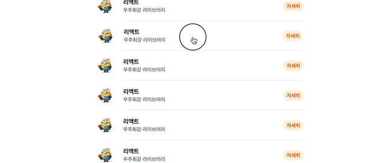
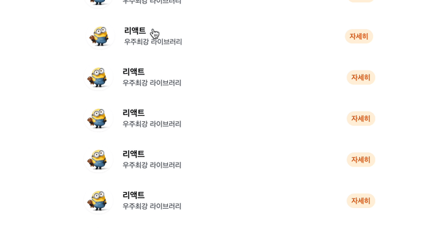
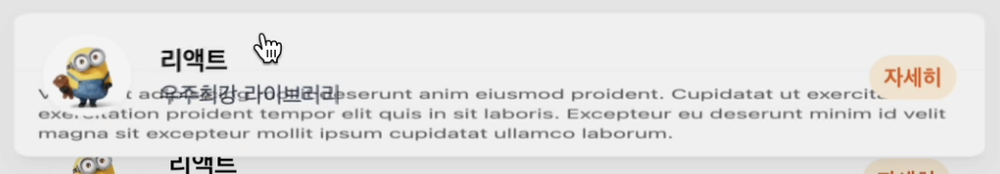
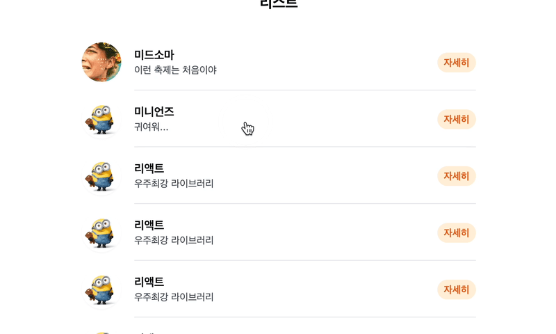

## 요약

바쁘신 분들을 위해, 먼저 내가 만들어낸 작업물을 보이고 글을 시작하고자 한다. 직접 인터랙션할 수 있다.

<iframe width="100%" height="500px" src="https://anim-smodal.vercel.app" scrolling="no" frameborder="0"></iframe>

## 머리말

난 모션 또는 트랜지션에 관련된 작업하는 것을 매우 좋아한다. 부차적인 것이라 생각할 수도 있겠지만, 자연스러운 모션과 트랜지션을 컴퓨터 세상에서 구현하는 것은 사용자 경험에 좋은 것은 물론이요, 개인적으로 우리가 사는 물리적 세계를 가상의 세계에 그려내는, (감히 말하지만) 숭고한 예술과도 같은 작업이라 생각한다.

그래서 나는 평소 [Emil Kowalski](https://emilkowal.ski/)님과 같은 개발자를 동경하며 그의 작업물(혹은 작품!)을 염탐하곤 한다. 아래와 같은 멋진 트랜지션들을 웹 세상에서 구현하시는 분이다.


그러던 중, 문득 이런 생각이 들었다.

> “감탄만 하고 있을 게 아니라, 나도 해보면 되지 않을까?”

그래서 만들어봤다. 생각보다 금방 만들어지긴 했다!

## 시도 #1

일단, React와 framer-motion으로 구현하고자 Vite와 TypeScript 프로젝트를 구성했다. 빠르게 스타일링할 수 있도록 tailwindcss를 도입해 빠르게 다음과 같은 화면을 구성했다.


컴포넌트 구성은 대략적으로 다음과 같이 했다.

```tsx
// Context
interface IItemListContext {
  item: Item[];
  activeItemId: number | null;
  setActiveItemId: React.Dispatch<React.SetStateAction<number|null>>;
}

// ItemList.tsx
function ItemListRow({ item, isActive, onClick }) { ... }
function ItemList() {
  return <ul>
    <ItemListRow />
    <ItemListRow />
    ...
  </ul>
}

// ItemOverlay.tsx
function ItemOverlay() {
  if (context.activeItemId === null)
    return null;
  else
    return <div className="fixed inset-0 z-10 ...">
      {/* Backdrop */}
      <div className="absolute inset-0 pointer-events-none ..."></div>
      {/* Modal */}
      <div {...}>
        {...}
      </div>
    </div>;
}

// App.tsx
function App() {
  return <ItemListContext.Provider>
    <ItemList />
    <ItemOverlay />
  </ItemListContext.Provider>;
}
```

### Layout Animations of framer-motion

framer-motion의 Layout Animations은 CSS 레이아웃의 변화를 자연스러운 애니메이션으로 구현해준다. 즉, 변화하는 값을 비교해 사이값들을 알아서 넣어주는 것이다! 정말 강력한 framer-motion의 기능이다.

### Shared Layout Animations of framer-motion

Layout Animations이 자신의 레이아웃 변화를 애니메이션으로 구현해준다. 그렇다면, 같은 요소 내에서가 아니라 서로 다른 요소 사이에서 자연스럽게 변화하도록 할 순 없을까? framer-motion에서는 이 기능을 Shared Layout Animations이란 이름으로 제공하고 있다.

Shared Layout Animations은 이 Layout Animations의 연장선인 기능이다. `layoutId`가 같은, Shared될 각각의 레이아웃을 framer-motion 측에서 분석해 애니메이션으로 구현해주는 것이다.

Shared Layout Animation을 단 하나의 `layoutId` 프롭으로 구현할 수 있다니, 정말이지 framer-motion의 가장 강력한 기능 중 하나라 생각한다. 이를 이용해 다음과 같이 리스트 항목과 모달 창을 이어줬다.

```tsx
// ItemListRow
<motion.li layoutId={`item-${item.id}`}>{...}</motion.li>

// Modal @ ItemOverlay
<motion.div layoutId={`item-${item.id}`}>{...}</motion.div>
```



상당히 어색하고 조잡한 애니메이션이 구현되었다. 원인은 다음과 같을 것이다.

첫째, 리스트의 항목과 모달 창 전체만 Shared Layout으로 트랜지션되었기 때문이다. 애니메이션 흐름 상 마찬가지로 Shared되어야 할 내부 항목들(사진 상의 리액트, 우주최강 라이브러리, 그리고 귀여운 미니언 밥의 사진)이 존재한다. 이들에 대해서도 각각의 `layoutId`을 가지게 해야 한다.

둘째, 새로 생기는 항목(사진 상의 Velit… 부분)의 비율이 모달 창의 변화를 따라간다. 즉, 뭉개진다. 물론 이건 문제라기보단 지향하지 않는 모습일 뿐이다.

## 시도 #2

앞선 문제들을 수정했다. 항목의 좌측 정렬 부분과 우측 정렬 부분이 따로 `layoutId`를 가지도록 해주었다.

```tsx
// ItemListRow
<motion.li layoutId={`item-${item.id}`}>
  <motion.img layoutId={`item-${item.id}-img`} />
  <div>
    {/* 왼쪽 항목 */}
    <motion.div layoutId={`item-${item.id}-left`}>
      <h3>{item.title}</h3>
      <p>{item.subline}</p>
    </motion.div>
    {/* 오른쪽 항목 */}
    <motion.div layoutId={`item-${item.id}-right`}>
      <button>자세히</button>
    </motion.div>
  </div>
</motion.li>

// Modal @ ItemOverlay
<motion.div layoutId={`item-${item.id}`}>
  {.../* 윗부분은 ItemListRow와 거의 동일하기 때문에 생략! */...}
  <div>
    <p>{item.description}</p>
  </div>
</motion.div>
```



이 정도면 만족할 정도라 생각할 수도 있을 것이다. 하지만 사실 다음과 같은 문제가 있다.



보이는가? 기존에 없던 새로운 항목인 설명글 부분은 모달 창 전체와 함께 애니메이션되기 때문에 비율이 뭉개짐은 물론이요, 다른 항목과 겹친다. 이는 앞서 설정한 지향점이 전혀 아니다.

설명글 부분은 모달 창 전체와 함께 애니메이션된다는 점이 문제였다. 그렇다면, 설명글 부분이 독립적으로 애니메이션되도록, 떨어뜨려놓으면 되지 않을까? 즉, 아래와 같이 `layout` 프롭을 추가해서 설명글 부분이 따로 애니메이팅되도록 해주자. (`layoutId`를 추가해주어도 마찬가지로 동작한다. 이는 두 방법 모두 부모인 모달 창에서 분리해주기 때문이다.)

```tsx
// Modal @ ItemOverlay
<motion.div layoutId={`item-${item.id}`}>
  {.../* 윗부분은 ItemListRow와 거의 동일하기 때문에 생략! */...}
  <motion.div layout> {/* 또는 <motion.div layoutId="dummy"> */}
    <p>{item.description}</p>
  </motion.div>
</motion.div>
```

사실 위 문제는 https://www.framer.com/motion/layout-animations/##scale-correction 와 매우 유사한 사례로 생각할 수 있다. 문서의 해당 부분에서도 내부에 있는 `.child`의 `layout` 프롭을 제거하면 부모와 같이 애니메이팅되느라 왜곡(distortion)이 일어난다. 이를 의도하는 것이 아니라면 왜곡을 막기 위해 `layout` 프롭을 추가해주면 된다. 그러면 내부의 요소의 레이아웃 또한 변형시키며 이러한 왜곡을 교정해준다.

> Transforms can also distort `boxShadow` and `borderRadius`. The `motion` component will automatically correct this distortion on both props, as long as they're set as motion values.


이 정도면 충분히 만족할 만 한 것 같다!

## 결과물



조금 더 다듬어 위와 같은 결과물이 만들어졌다!

끝!