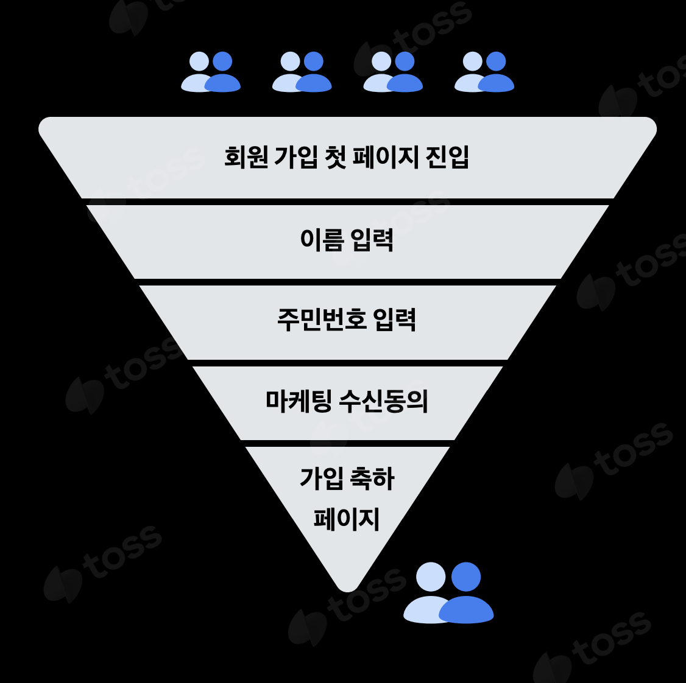
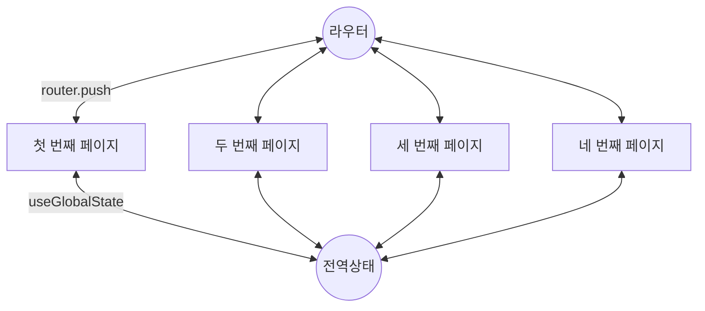
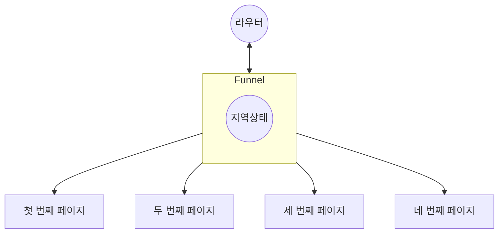

> [!note] 일러두기
>
> [토스 Slash 2023](https://www.youtube.com/watch?v=NwLWX2RNVcw)에서 다룬 내용을 토대로, 저만의 순서와 언어로 재구성했습니다.

## Funnel in marketing

https://business.adobe.com/kr/blog/basics/funnels-analysis


By <a href="//commons.wikimedia.org/w/index.php?title=User:BronHiggs&amp;action=edit&amp;redlink=1" class="new" title="User:BronHiggs (page does not exist)">BronHiggs</a> - <span class="int-own-work" lang="en">Own work</span>, <a href="https://creativecommons.org/licenses/by-sa/4.0" title="Creative Commons Attribution-Share Alike 4.0">CC BY-SA 4.0</a>, <a href="https://commons.wikimedia.org/w/index.php?curid=53843096">Link</a>

퍼널은 깔때기를 뜻하는 말로, 마케팅 영역에서는 잠재적인 고객을 유입하고 최종적인 전환에 이르기까지 전체의 단계를 하나의 모델로 분석하는 것을 뜻합니다. 각 단계별로 점점 좁은 범위로 좁혀진다는 뜻에서 비유적으로 사용된 용어 같다.

## Funnel in FE development

마케팅에서 사용되는 퍼널 모델, 프론트엔드 개발에서도 자주 사용되는 패턴이다. 생각해보니, 나도 과거 프로젝트에서 이런 패턴이 있었고, 그때도 이걸 어떻게 처리할지 고민했었다. 결국 전역 상태로 구현하였지만, 아쉬웠었다. 그 과정들이 여러 페이지로 이루어졌지만 그 페이지들의 집합이 결국 하나의 페이지 또는 컴포넌트처럼 독립적이라 생각했고 이 때문에 전역 상태로 둔다는 것이 마음에 걸렸던 것이다. 그런 점에서 이런 패턴에 대한 “Funnel” 접근은 매우 흥미로웠다!



**퍼널 패턴을 기존에 구현하던 방식**



**Funnel 방식**



#### Funnel 방식 코드로 구현하기

유저가 기입/선택한 정보는 `registerData`, 현재 스텝은 `step`이라는 지역 상태로 관리한다.

```ts
const [registerData, setRegisterData] = useState();
const [step, setStep] = useState<
  "가입방식" | "주민번호" | "집주소" | "가입성공"
>("가입방식");
```

한 흐름으로 관리해야 하는 UI들을 넣는다.

```tsx
const [registerData, setRegisterData] = useState()
const [step, setStep] = useState<"가입방식"|"주민번호"|"집주소"|"가입성공">("가입방식")

return (
  <main>
    <가입방식 />
    <주민번호 />
    <집주소 />
    <가입성공 />
  </main>
);
```

`step`에 따라 조건부로 하위 페이지를 선택해 렌더링한다.

```tsx
const [registerData, setRegisterData] = useState();
const [step, setStep] = useState<
  "가입방식" | "주민번호" | "집주소" | "가입성공"
>("가입방식");

return (
  <main>
    {step === "가입방식" && <가입방식 onNext={(data) => setStep("주민번호")} />}
    {step === "주민번호" && <주민번호 onNext={() => setStep("집주소")} />}
    {step === "집주소" && <집주소 onNext={async () => setStep("가입성공")} />}
    {step === "가입성공" && <가입성공 />}
  </main>
);
```

API 호출에 필요한 상태를 한 번에 관리한다.

```tsx
// 생략
{
  step === "가입방식" && (
    <가입방식
      onNext={(data) => {
        setRegisterData((prev) => ({ ...prev, 가입방식: data }));
        setStep("주민번호");
      }}
    />
  );
}
// 생략
```

만약, 스텝이 추가되더라도 유연하게 관리할 수 있게 되었다.

#### 추상화하기

이 패턴을 라이브러리 같이 추상화하여 재사용성을 높일 수 있다. 이를 통해 사용하는 측에서는 복잡도의 증가 없이 훌륭한 패턴을 쉽게 적용할 수 있다.

먼저, `step`과 관련된 로직을 묶을 수 있다. 여기선 `Step`이라는 컴포넌트를 통해 묶어주었다.

```tsx
const [registerData, setRegisterData] = useState();
const [step, setStep] = useState<
  "가입방식" | "주민번호" | "집주소" | "가입성공"
>("가입방식");

return (
  <main>
    <Step if={step === "가입방식"}>
      <가입방식 onNext={() => setStep("주민번호")} />
    </Step>
    // ...
  </main>
);
```

위 패턴에서 각 스텝은 `step` 상태에 따라서만 조건이 정해지므로 아래와 같이 더 추상화할 수 있다.

```tsx
const [registerData, setRegisterData] = useState();
const [step, setStep] = useState<
  "가입방식" | "주민번호" | "집주소" | "가입성공"
>("가입방식");

return (
  <main>
    <Step name="가입방식">
      <가입방식 onNext={() => setStep("주민번호")} />
    </Step>
    // ...
  </main>
);
```

다만, 이제 `Step` 컴포넌트가 현재의 `step`을 알고 있어야 하는 구조가 되었다. 이를 위해 `step` 상태와 `Step` 컴포넌트를 함께 관리하도록 커스텀 훅을 작성한다.

```tsx
function useFunnel() {
  const [step, setStep] = useState();

  const Step = (props) => {
    return <>{props.children}</>;
  };

  const Funnel = ({ children }) => {
    const targetStep = children.find((child) => child.props.name === step);
    return Object.assign(targetStep, { Step });
  };

  return [Funnel, setStep];
}
```

이제, 이 커스텀 훅을 적용하면

```tsx
const [registerData, setRegisterData] = useState();
const [Funnel, setStep] = useFunnel<"가입방식" | "주민번호">("가입방식");

return (
  <Funnel>
    <Funnel.Step name="가입방식">
      <가입방식 onNext={() => setStep("주민번호")} />
    </Funnel.Step>
    // ...
  </Funnel>
);
```

추가적으로 라우터 히스토리와 함께 관리할 수 있다.

```tsx
function useFunnel() {
  const step = useQueryParam("step");

  const setStep = (step: string) => {
    const nextUrl = `${QS.create({ ...prevQuery, step })}`;
    router.push(url, undefined, { shallow: true });
  };

  //...
}
```

## 마무리

이후에도 Funnel과 관련된 더 많은 내용(DX를 위한 디버깅 툴 등)이 [발표](https://www.youtube.com/watch?v=NwLWX2RNVcw)에서 설명되고 있다.
