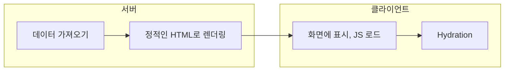

[이번 프로젝트](https://hoqn.net/works/readiary)에서 Next.js를 사용하기로 결정해 작업을 진행 중이다. 한편, Next.js에는 두 가지 라우팅 구성 방식이 있는데, 전통적인 Pages Router가 있고, 13버전부터 추가되어 현재는 Stable로 릴리즈된 App Router가 있다. 이번 프로젝트에선 어떤 걸 쓸지 고민하다 익숙한 방식보다 vercel에서 더 추천하고 있지만 아직은 낯선 App Router를 도입하기로 했다.

App Router는 Next.js 측에서 [React Server Component](https://react.dev/blog/2020/12/21/data-fetching-with-react-server-components)를 더 적절히 지원하기 위한 구조라고 해도 될 것이다. 그럼, Server Component가 대체 무엇이고, 어떤 이득 때문에 새로운 폴더 구조를 사용해야 할 정도로 바뀐 것일까?

> [!warning] 주의
> 
> 이 글은 저의 견해가 많이 섞여 있어요.  
> 틀린 내용이나 적절치 못한 내용이 있을 수 있으니 정확한 설명은 별도의 **공신력 있는 문서나 글**에서 확인해주세요!
> 
> 틀렸거나 부적절한 내용은 제보해주시면 정말 감사하겠습니다 ㅎㅎ

# Server Component란

React Server Component(RSC)는 말 그대로 서버에서 완전히 실행되고 렌더링되는 컴포넌트를 뜻한다. 서버에서 실행되기 때문에 서버 자체에서 캐싱을 할 수도 있다.

> 잠깐, Next.js가 Server-side Rendering(SSR)이고, 그게 결국 서버에서 실행되고 렌더링되는 거 아니야? 그럼 RSC가 추가되기 전의 SSR은 뭐야?

라는 생각이 들 수 있다. 공교롭게도 Server Component가 아닌 컴포넌트는 Client Component라고 하기 때문에 마치 SSR, CSR과 비슷하게 느껴지기도 한다. 나도 처음엔 이 부분이 매우 헷갈렸다. 결론적으로, 내가 이해한 바를 간단히 나타내면 다음과 같다.

> - Server Component는 서버에서'만' 실행된다.
> - Client Component는 서버와 클라이언트 모두 실행될 수 있다.

헷갈릴 땐 이것만 기억하면 무엇을 써야하는지 정하기 수월할 것이다. 그럼 더 자세히 살펴보자.

## Client Component의 Server-side Rendering

Server Component를 알기 전, Client Component의 Server-side Rendering부터 짚고 넘어갈 필요가 있다.

SSR을 구현하다 보면 **Hydration**이라는 말을 많이 듣게 된다. 이는 아주 간단히 말해서 정적으로 렌더링된 HTML(서버에서 렌더링)에 js 코드(React 코드)를 연결해주는 거라 말할 수 있다.



이 과정을 생각하면 SSR이라 해도 서버에서'만' 코드가 실행되는 것이 아니란 게 수긍된다. 서버에서 정적인 HTML 마크업을 렌더링할 때는 서버에서 실행되지만, Hydration이 된 후 결국 클라이언트에서도 실행되는 것이다. 흔히 state, handler 등 interative한 부분들이 클라이언트에서 실행되게 된다.

그럼, Server Component는 서버에서만 실행된다고 했으니 interactive한 기능을 가지지 못하는 것일까? 맞다! Server Component는 state, handler 등을 가질 수 없다. 이를 원한다면 `use client` 지시문을 추가해 Client Component를 사용해야 한다.

## Server Component에서의 Hydration

그럼, Server Component는 Hydration이 일어나지 않을까? 궁금해서 찾아봤다.

엄밀히 말해 Server Component 동작의 모든 과정이 서버에서만 일어나는 것은 아니다. Server Component도 Hydration을 필요로 하기 때문이다. Server Component는 (아래서 설명할) Streaming API 등을 통해 클라이언트에 각각 전달된다. 심지어 각각의 부분은 다른 Server Component나 Client Component와도 섞여있다. 따라서 그 컴포넌트가 어디에 존재하지 알고 있어야 하고, 하위에 Client Component가 존재할 수 있기 때문에 엄밀히 말하면 Hydration이 필요하다.

(결론적으로, Hydration은 일어나지만 여전히 Server Component 내의 로직 자체는 서버에서만 동작한다.)

# Server Component의 등장 배경

많은 신기술들은 그 자체의 정의보다 어떤 배경 또는 어떤 필요 속에서 탄생했는지가 더 중요하다. 대체 왜 Meta와 Vercel은 Server Component라는 개념을 등장시킨 것일까?

[Vercel에 의하면](https://vercel.com/blog/understanding-react-server-components), 다음과 같은 문제점을 해결하기 위함이라고 밝히고 있다.

- 컴포넌트를 표시하기 전에 페이지 전체에 대한 데이터를 받아와야 한다. 이를 달성하기 위한 유일한 방법은 `useEffect()` 훅 안에서 클라이언트 측 데이터를 가져오는 것인데, 이는 서버 측에서 가져오는 것보다 라운트트립(roundtrip) 시간이 더 길고, 가져오는 시점 또한 페이지가 완전히 렌더링되고 Hydrate된 후로 조금 늦다. (주. 이것은 결국 Waterfall과도 연관되는 문제이다.)
- 모든 페이지가 서버에서 미리 실행되어 렌더링된다고 하더라도, 결국 코드가 클라이언트에서 다운로드된다. 앱의 복잡성이 커짐에 따라 클라이언트에서 다운로드되는 코드의 양 또한 증가한다.
- Hydration 최적화에도 불구하고, 사용자는 클라이언트 측에서 JS 코드가 다운로드되고 적용될 때까지 인터랙션을 할 수 없다는 사실은 그대로이다.
- 다양한 기기에서 실행되는 클라이언트 환경보다, 더 강력하고 예측 가능한 서버에서 JS를 실행하는 게 낫지 않을까?

이 부분만 알고 나면 어디서 

# 그래서, 장점이 뭔데?

결론적으로, 개발자 입장에서 Client Component에 비해 여러 모로 제약 조건이 많은 이 Server Component가 권장되는 이유는 무엇일까? [Next.js의 공식 문서](https://nextjs.org/docs/app/building-your-application/rendering/server-components#benefits-of-server-rendering)에서는 다음과 같은 장점들을 언급하고 있다.

- **Data Fetching**
- Security
- Caching
- Bundle Sizes
- **Initial Page Load & First Contentful Paint**
- Search Engine Optimization & Social Network Shareability
- **Streaming**

내가 조사하고 고찰해본 결과, 볼드체로 칠한 3가지 정도가 가장 주요한 이유가 될 것 같다.

> 네 번째에 있는 Bundle Sizes에 대해서는, 정적 컨텐츠만 제공되기 때문에 사용한 패키지가 번들 사이즈에 영향을 끼치지 않는다.

### Data Fetching (+Security)

Server Component는 데이터 페칭도 서버에서 진행한다. 기존 Next.js의 Page Router에서 `getInitialProps`를 사용하는 것과 비슷한 결과를 가진다. 이 점은 아래와 같은 장점을 가진다.

- 더 빠르다. Data Source와 보다 가까운 Server에서 데이터 요청이 이뤄지기 때문에 더 효율적이다. 공식 문서에서 제시하고 있는 장점이다. 아무래도 불특정 사용자의 Client에서 데이터소스로 요청하는 것보다는 고정된 Server에서 요청하는 것이 더 안정적이고 빠르긴 할 것이다.
- 더 편하다. 이건 내가 사용하며 느낀 것인데, `getInitialProps`는 결국 Props으로 넘기는 것이기 때문에 컴포넌트 자체에선 Props에서 데이터를 받아 쓰는 것이나 마찬가지다. 이 부분은 어떻게 보면 컴포넌트의 독립성 측면에선 더 나을 수도 있으나, 일단 작성하기 까다로운 건 사실이다. Server Component에서는 그냥 컴포넌트 내에서 async로 자유롭게 호출하면 된다. 물론, Client Component 기능이 필요한 경우 결국 Server Component로 Client Component로 래핑하는 등의 작업이 필요하기 때문에 명확한 장점은 아니다.
- 보안 측면에서 유리하다. 데이터 페칭을 서버에서 하기 때문에 API 요청키나 토큰 같은 민감한 정보를 서버에만 둘 수 있다.

### Initial Page Load & First Contentful Paint

**First Contentful Paint(FCP)** 는 컨텐츠가 포함된 첫 페인트를 뜻한다. 이 페인트가 발생하는 데 걸리는 시간을 사용자 경험 성능 측정 지표로 사용하기도 한다. 당연히 짧을수록 더 좋다고 한다.

Server Component는 모든 요소를 서버에서 렌더링한 뒤 (별도의 실행이 필요한 JS가 아닌) HTML과 같은 형태로 Client에 제공되기 때문이다.... 라며 공식 문서에서는 장점이라고 하는데, 솔직히 크게 공감하진 않는다(오히려 해당 이유로 부족한 FCP 지표를 뒤에서 언급할 Streaming API가 멋지게 극복한다고 생각한다). 어쨌든 Client Component에서는 `서버에서 렌더링 -> 클라이언트에서 data fetch -> 받아온 정보로 클라이언트에서 추가 렌더링`과 같은 과정을 거치는 반면 Server Component는 `서버에서 data fetch + 서버에서 렌더링 -> 클라이언트`의 흐름을 거친다.

이건 무작정 장점이라고 보긴 좀 애매한 감이 있다. 하지만 장점이 될 때는 매우 강력한 장점이 된다. React에서는 Waterfall 현상을 경계한다. 간단히 말해 렌더링이 된 후 데이터를 요청하고, 그 요청된 데이터로 추가적인 렌더링이 이뤄지고, 그 렌더링이 된 후 다른 데이터를 또 요청하고…와 같은 흐름이 나타나는 현상이다. 앞의 Client Component는 이러한 현상이 나타난다. 하지만 Server Component는 렌더링 전 서버에서 컨텐츠를 채운 뒤 렌더링하고 클라이언트에 제공하기 때문에 이런 문제에서는 조금 자유롭다. 이 과정에서 Suspense의 사용도 자연스러워진다. (+ 타입 시스템 측면에서도 더 Type-safe하기도 하다. 애초에 렌더링 전에 데이터를 받아오기 때문에)

그런데, 이런 경우 오히려 먼저 보여줄 수 있는 곳까지 보여주지 않게 되어 결과적으로 더 좋지 않은 경험을 줄 수도 있지 않을까? **Contentful하면서도 좋은 반응성을 원한다면 React Suspense를 적절히 조합하자.** Suspense는 아직 로딩 중인 부분에 대해 대체 컴포넌트를 제공하는 기능이다. Next.js App Router에선 `loading.jsx|tsx`로 간단히 구현할 수 있도록 해주었다. 이때 적절한 로딩 UI를 구성한다면 오히려 더 매끄럽고 만족스러운 경험을 제공할 수 있을 것이다.

다만, 내가 겪은 단점으로는 이러한 점을 십분 활용하려면 파일을 조각조각 내야 하기 때문에 경우에 따라 과도한 복잡성을 가져다 줄 수 있을 것 같다는 게 내 생각이다. (Server Component에 집착하기보다는 그냥 별도의 Suspense 처리를 적절히 하는 게 나을 수도 있지 않을까? 싶은 생각)

~~다만, 아직(2023년 하반기)까진 Client Component에서 하는 로딩 처리보다는 불만족스러웠다. 로딩이 필요한 순간 바로 `loading.tsx`가 로드되지 않았기 때문이다. 약간의 딜레이 후 로딩 화면이 보였고, 그 다음 결과 화면이 나타났다. 약간의 딜레이가 있다는 것이 로딩을 위한 로딩을 하는 느낌이라 사용자 경험에서 매우 좋지 않아 보였다. 다만, `loading.tsx`을 이용하지 않고 직접 `<Suspense>`를 사용하는 방법 또한 존재하기 때문에 적절히 사용하면 될 듯 하다.~~ 더 많은 조사를 진행하고 수정하려 한다.

### Streaming

내가 생각할 때 가장 중요한 특징이다. 앞선 장점들은 Page Router에서의 SSR과도 어느 정도 공유하는 장점이다. 하지만 Streaming은 App Router와 Server Component만 가지는 장점이다.

Streaming은 렌더링 작업을 청크로 분리한 뒤 청크들마다 준비되는 대로 클라이언트로 스트리밍하는 방법이다. React 18에서 등장한 최신 기술이다.

기본적으로 Hydration 작업이 요구되는 SSR 방식은 기본적으로 각 단계가 전체 페이지에 대해 동작한다. 페이지를 구성하는 A, B 섹션들 중 하나라도 늦게 렌더링된다면 전체 페이지가 늦게 제공된다. 그런데 만약, 한 페이지를 구성하는 컴포넌트들 중에서 준비되는 대로 그때그때 보내준다면 어떨까? 이걸 가능케 하는 것이 바로 Streaming API이다. (Hydration도 각각 일어난다) Next.js의 Server Component는 이 Streaming을 활용할 수 있게 해준다. 그 전에는 부분적인 렌더링 작업을 달성하려면 결국 CSR이 필요했다. 하지만 Streaming API는 SSR에 대해서도 부분적인 렌더링을 가능케 한다.

#### Parallel Routes

Streaming API를 가장 직접적으로 느껴볼 수 있는 건 Parallel Routes 아닐까 싶다. 병렬 라우팅. 이름처럼 한 루트에 대해 여러 페이지 컴포넌트를 가지는 것이다. 화면으로는 한 페이지로 구성되지만 동작은 마치 각각의 페이지처럼 동작한다는 것이다. Next.js에서의 Parallel Routes는 아래와 같은 구조를 가진다.

```
dashboard/
  @a/
    page.tsx
    loading.tsx
  @b/
    c/
      page.tsx
    page.tsx
    loading.tsx
  layout.tsx
  loading.tsx
```

이런 식으로 구성한 뒤, `layout.tsx`에서 다음처럼 `children` 대신 `a`, `b` 등의 자식 노드를 props으로서 사용하면 된다. (`children`도 결국 이러한 Parallel Routes의 특수한 경우로 볼 수 있다)

```tsx
// layout.tsx
export default function Layout(props: { a: React.ReactNode, b: React.ReactNode }) {
  return (<div>
    <section>
      <h4>This is a section 'A'</h4>
      <div>{props.a}</div>
    </section>
    <section>
      <h4>This is a section 'B'</h4>
      <div>{props.b}</div>
    </section>
  </div>);
}
```

이런 식으로 구성하면 `section A`와 `section B`가 따로따로 로딩 상태를 보여주는 걸 직접 확인해볼 수 있다.직접 확인하기 쉽도록 Parallel Routes를 활용한 것일 뿐, 이 경우에만 Streaming API가 동작한다고 생각하진 않아야 한다. 조각조각난 컴포넌트들이 모두 기본적으로 Streaming된다.

# 여전히 중요한 Client Component

내가 프로젝트에 Server Component를 활용하며 느낀 것은, Client Component도 중요하다는 것이다. 아무래도 신기술이기도 하고, vercel에서도 사용을 권장하다 보니 무조건 Server Component가 더 나은 선택지로 보인다. 하지만 Server Component의 단점도 명확하다.

우선, Interactive한 컴포넌트를 만들 수 없다. 앞서 언급한 대로, state, handler 등을 가질 수 없기 때문에(그냥 런타임 js가 없다고 생각하면 편하다) 한계가 많다. 그래서 어떻게든 `"use client";`를 쓰지 않기 위해 애쓰기보단 필요하다면 Client Component로 구현하고, interactive가 확실히 없고, 추가적인 data fetching도 없는 경우만 Server Component로 쓰자는 정도로 생각하고 있다. Next.js에서 opt-in으로 Client Component를 제시하고 있지만 이는 우선적으로 Server Component를 사용하라는 의미일 뿐, 최대한 Server Component로 구현하라는 말은 아닐 거라 ~~마음대로~~ 결론지었다.

# 정리.

개인적으로 Server Component는 Next.js의 풀스택 프레임워크 성격을 강화하는 멋진 기능이라 생각한다. 하지만 모던 프런트엔드 환경에서 interactive를 포기한다는 것은 너무 많은 것을 버리는 것이다. 따라서 Server Component를 '우선적'으로 쓰되, 필요할 때는 '유연하게' Client Component를 사용하는 게 가장 중요하다. 물론 이 과정에서 많은 고민이 필요할 것 같다. 파일을 나눠야 하기 때문에 과도한 복잡성을 가지지 않도록 적당한 수준으로 Server Component와 Client Component를 분리하는 게 중요해 보인다.

처음엔 그 기준을 찾는 게 어려웠지만 조사를 통해 어떤 문제를 해결하기 위해 이 신기술이 도입되었는지, 또 어떤 식으로 동작하는지를 알게 되어 기준을 선택하는 게 조금 더 쉬워진 것 같다. 추상적으로 '자세히는 모르는데 사람들이 이게 좋대!', '자세히는 모르는데 이렇게 하면 더 빠르대!' 하고 쓰는 것 만큼 위험한 게 없다고 평소 생각하기 때문에, 조금 느릴지라도 왜 이걸 쓰는지 묻는 과정은 매우 중요하다는 마음으로 기록하다보니 장황해졌다.

메모 같이 남겨둔 내용들을 장황함 때문에 draft로 놔두다 겨우 마무리 짓는다. 좀 더 간결한 글을 쓰는 연습이 필요할 듯 하다 ㅎㅎ..

fin.