> [Source Code](https://github.com/Cinema-Seoul/cine-seoul-fe)

학부 전공 과목 중 설계 과목으로 *데이터베이스설계및실습*이란 과목을 수강하게 되었다. 이름 그대로 데이터베이스를 설계하고 이를 활용한 실습을 해보는 과목이다. 상황은 과목에서 제시되었고, 이를 해결하는 서비스를 개발하는 것이 과제였다.

# 1. 프로젝트 개요

본 프로젝트에서는 여러 개의 상영관을 가진 멀티플렉스 영화관의 인터넷 영화예매 시스템을 구축하기 위한 데이터베이스를 설계하고, 이 데이터베이스 위에서 동작하는 응용 프로그램을 개발한다.

서울시네마는 전체 2,100석의 좌석을 보유하고 있고, 8개의 상영관을 가지고 있으며 각 상영관마다 하루 평균 6회의 영화를 상영 중에 있다. 좋은 위치와 멀티플렉스라는 장점으로 독점을 하였으나 최근 XX에 멀티플렉스 영화관이 속속 생겨나면서 경쟁을 하고 있다.

## 1.1. 시스템 구축 방향

- 현재 티켓링크와 맥스무비의 예매 시스템 분석

- 인터넷 결제를 통한 영화표 예매

- 데이터베이스 기반의 관리 시스템 구축

## 1.2. 환경

- 3인 1조

- 오라클 DBMS

- 개발 환경
  
  - 백엔드: Spring Boot (JAVA) 2명
  
  - 프론트엔드: **React (TypeScript) 1명** ← 내가 맡은 부분
  
  - 데이터베이스 설계 및 산출물 작성: 3명 모두

# 2. 설계

## 2.1. 데이터베이스 설계

데이터베이스 설계는 3명이 모두 함께 진행하였다.

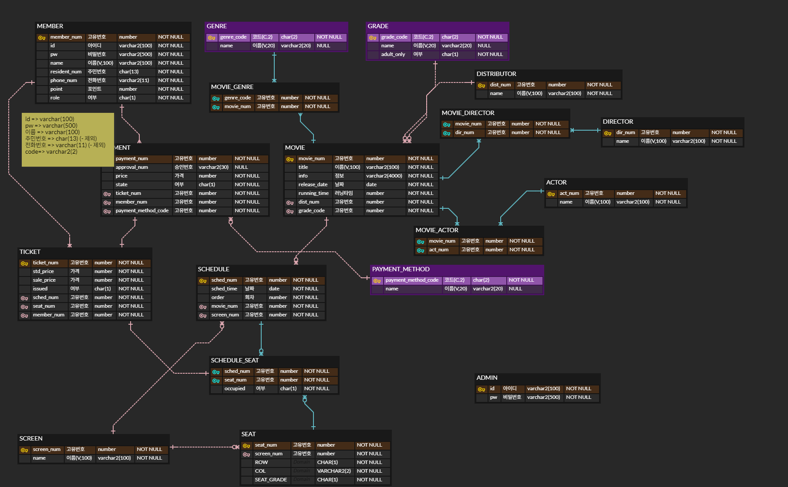

ERD를 여러 번에 걸쳐 회의하고, 또 수정했다. 적절한 관계를 설정하고, 또 필요한 데이터들을 정했다.

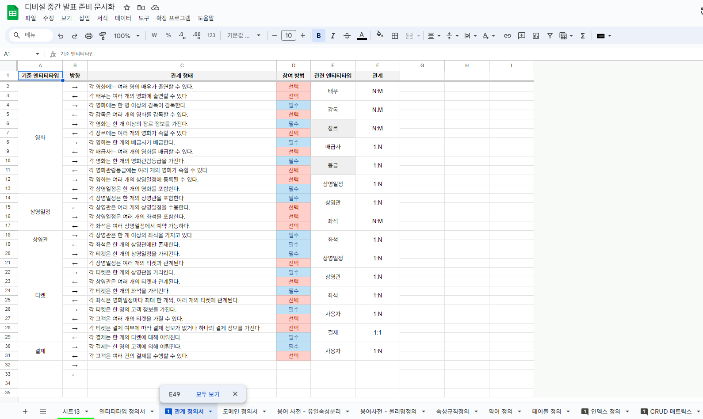

더불어서, 필요한 산출물들도 Google Sheets를 활용해 작성하였다.

## 2.2. 인터페이스 설계

인터페이스 설계는 프론트엔트를 맡은 내가 담당하였다. 피그마를 사용해 기본적인 부분만 빠르게 설계하였다.

# 3. 개발 (프론트엔드)

## 3.1. 프론트엔드 개발

프론트엔드 개발을 하는 데 다음과 같은 환경을 세팅하여 개발하였다.

- `react`, `typescript`, `vite`, `react-router-dom`
- 스타일링: `unocss`, `@radix-ui/colors`
- 애니메이션: `framer-motion`
- 전역 상태: `zustand`

# 4. 개발 결과 (프론트엔드)

## 4.1. 영화 목록 및 세부 정보

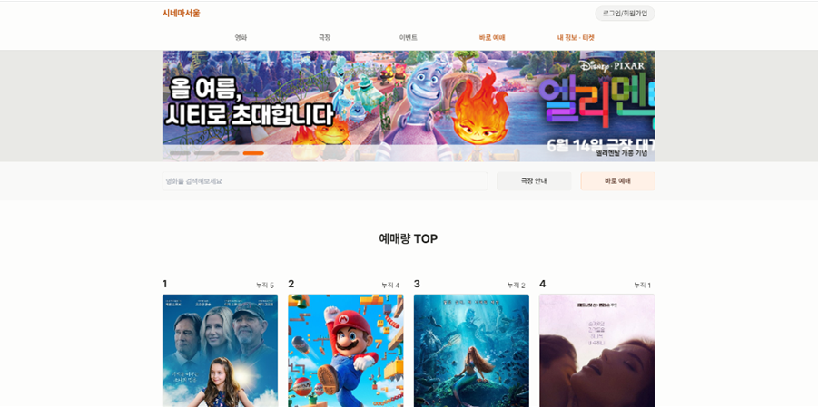

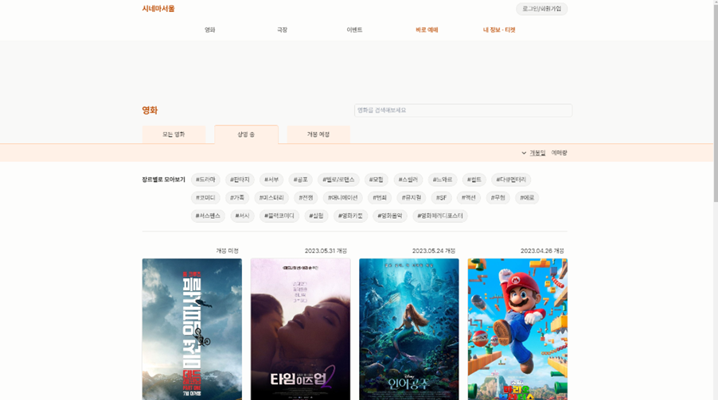

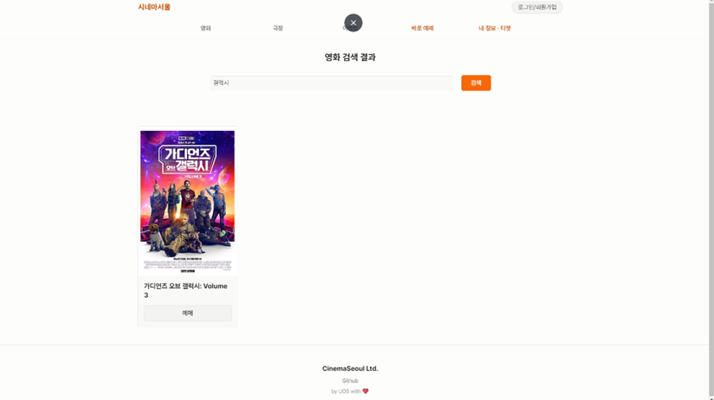

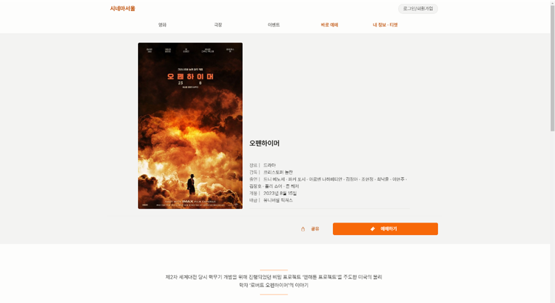

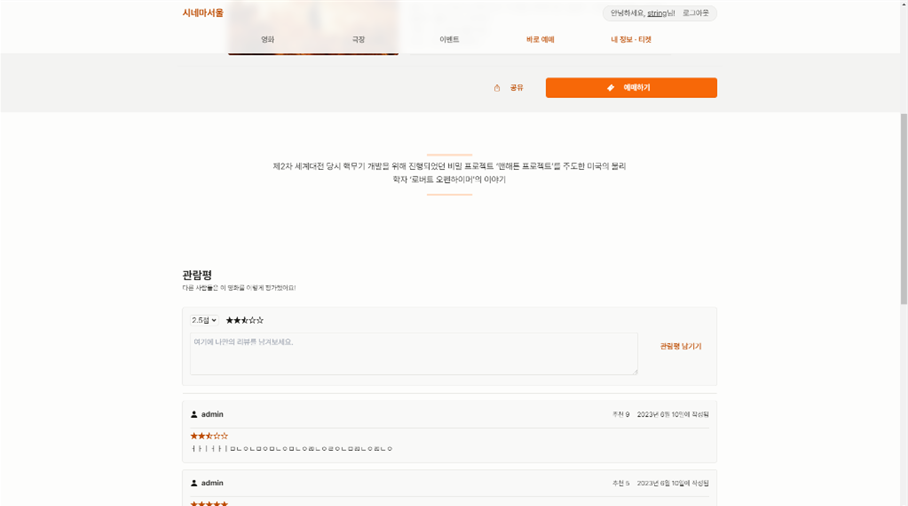

## 4.2. 영화 예매

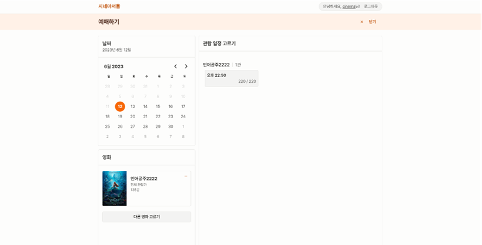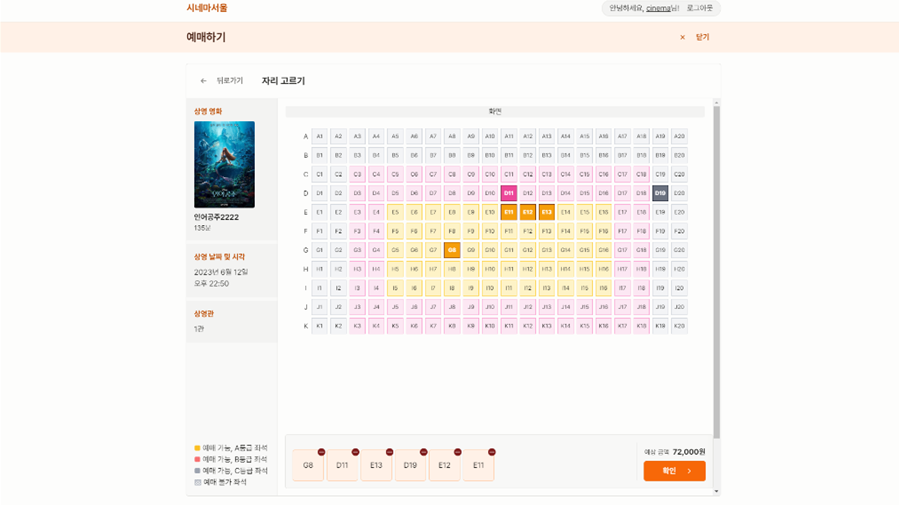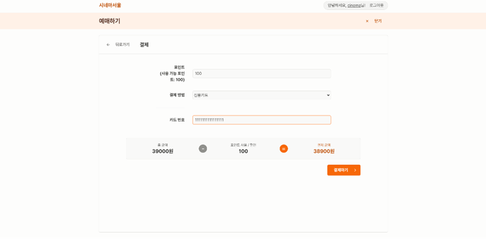

## 4.3. 관리자 페이지

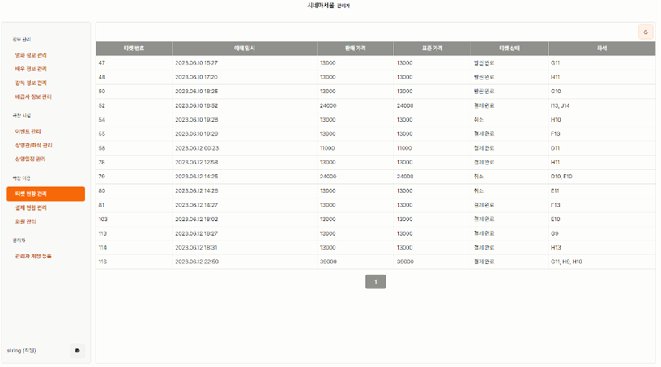

# 5. 회고

## 5.1. SPA로 구현했다는 아쉬움

개인적으로 이번 프로젝트에서 `Next.js`를 이용해 SSR에 기반한 MPA로 구현하고 싶었지만, 개발 일정이 짧아 `react-router-dom`만을 이용해 SPA로 구현하였다. 최소한 관리자 페이지와 고객 페이지는 완전히 별개이기 때문에 따로 lazy 로딩 처리를 해주었다는 점에서 만족해야 했다 :\(

## 5.2. Form validation을 미련하게 구현했다는 생각

`react-hook-form`이라는 좋은 라이브러리가 있다는 것은 이미 알고 있었다. 하지만 익숙지 않아서인지, 괜한 자존심인 건지 Form validation 관련한 훅을 직접 만들었다. 미련한 짓일지도 모르겠지만, 그 과정에서 재미있기는 했다. 아래가 내가 직접 구현했던 Form validation 훅을 사용한 컴포넌트이다!

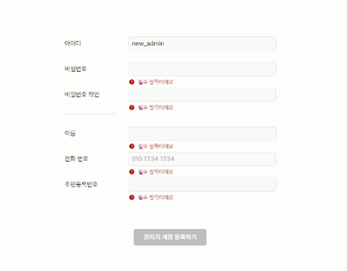

직접 구현해본 경험은 좋았지만, 완성도 측면에서는 `react-hook-form`과 같은 검증되고 훌륭한 라이브러리를 사용하는 것이 더 나을 것 같다. 다음에는 꼭 사용해보려 한다.
