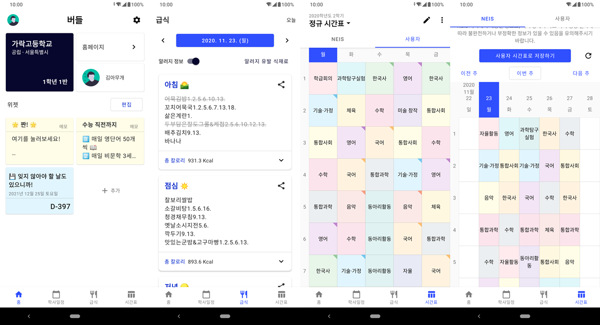

교육부 NEIS의 공개 API를 활용한 전국 초중고 학교 생활 도우미

(Buddle은 프로젝트명)

# 1. 기획

고등학교에 다닐 때부터 급식 메뉴나 시간표를 확인할 수 있는 앱이 있으면 좋겠다는 생각이 항상 들었었다.

그래서 실제로 고등학생 때 내가 다니던 학교인 전일고등학교 홈페이지의 HTML을 그대로 파싱해 공지사항, 급식 메뉴 등을 볼 수 있는 앱을 만들었던 경험이 있다. 하지만 이는 HTML 코드를 직접 파싱하는 작업이기 때문에 여러 학교에 적용할 수 없었고, 홈페이지가 약간만 수정되어도 앱의 코드를 수정해야 한다는 점 등의 문제점이 많았다.

대학생이 되고 취미 삼아 만들 프로젝트를 구상하던 도중, 교육부 NEIS에서 공개 API를 제공한다는 사실을 알게 되었다. 이를 적용해 전국 초중고 학교 생활 도우미 앱을 만들고자 하였다.

## 1.1. 개발환경

- 개발언어: Kotlin (Android Native)
- 개발환경: Windows10, Android Studio

## 1.2. 주요기능

- 급식 메뉴 확인 ← NEIS Open API
- 학사일정 확인 ← NEIS Open API
- 시간표 확인 ← NEIS Open API
- 시간표 관리

## 1.3. 프로토타이핑 및 디자인

안드로이드 네이티브 앱인만큼 Google의 Material Design을 따르도록 디자인하였다.

- **초기 디자인 (Adobe XD)**
  
    

- **수정본 (Android)**
  
  

- **최종 출시 (Android)**
  
  

- **업데이트(v0.4.0)**
  
  (완료 및 유지보수의 기능 추가 목록 참고 바람)

# 2. 개발 구조

## 2.1. 개발환경

Android Native로 개발하였고, 언어는 Kotlin을 사용하였다. IDE는 Android Studio를 사용하였다. AndroidX Jetpack을 적극적으로 활용하였다.

## 2.2. 메인 네비게이션

- [Bottom Navigation](https://material.io/components/bottom-navigation/android)
  
  Material Design의 `Bottom Navigation`을 메인 네비게이션으로 사용하였다. Android Jetpack의 권고에 따르면 [`Navigation Components`](<https://developer.android.com/guide/navigation>)을 이용해 네비게이션을 구현해야 한다. 따라서 처음엔 이를 통해 구현하였으나, 이럴 경우 탐색할 때마다 Fragment가 재생성되어 사용자에게 불편함을 줄 수 있어 단순히 Bottom Navigation의 `setOnItemSelectedListener`로 사용자의 클릭을 인식한 뒤 Fragment를 show/hide만 하는 방법으로 네비게이션을 구성하였다. Navigation Components도 커스텀하면 원하는대로 할 수 있다는 것도 검색을 통해 알게 되었지만, 어차피 앱의 탐색 구조가 단순하기 때문에 Navigation Components의 사용을 포기하였다.

- 뒤로가기 처리
  
  뒤로가기(Back) 버튼 처리는 기본적으로 홈 화면에서 뒤로가기를 누르면 앱 종료, 홈 화면 외의 화면에서 뒤로가기를 누르면 홈 화면으로 이동하는 구조로 설계하였다.
  
  다만, 한 가지 예외가 있는데, 학사일정 화면에서 월 선택을 하는 부분이 활성화되어 있을 땐 이를

## 2.3. 홈

홈 화면에서 가장 핵심적인 기능은 바로 ‘위젯’ 기능이다. 홈 위젯에 대한 데이터는 [Gson](https://github.com/google/gson)을 이용하여 직렬화하여 .json 파일로 저장된다.

위젯의 종류는 2가지인데, `DDayHomeWidget`, `SimpleMemoHomeWidget`이다. 두 위젯 모두 `HomeWidget` 인터페이스를 구현한다. (따라서 HomeWidget을 구현하기만 한다면 또 다른 위젯들의 추가도 충분히 가능하다.)

## 2.4. 학사일정

학사일정 화면을 개발하는 데 있어 가장 어려웠던 부분은 날짜 표시 부분을 Sticky하게 만드는 것이었다. Sticky 헤더를 구현하기 위해 단순한 RecyclerView로 화면을 구성하지 않고, RecyclerView에 Decoration을 적용하는 방식으로 구현하였고, 스크롤할 때마다 좌표를 계산하여 헤더의 위치를 정한다.

## 2.5. 급식

급식 기능이 가장 간단했던 부분이다. 데이터의 양도 최대 세 개(아침, 점심, 저녁)로 정해져있으며, API에서 데이터를 받아와 처리해야 하는 부분도 알러지 반응 유발 식품 표시만 해주면 되었다.

- 알러지 유발 식품 표시
  
  NEIS의 API의 정보에선 급식 메뉴 목록 끝에 `숫자.`의 형태로 알러지 정보를 담고 있다. 각각의 숫자는 특정한 알러지 유발 요인을 나타낸다.
  
  따라서 받아온 정보에서 사용자가 설정한 알러지 정보에 해당하는 숫자가 끝에 포함되어 있다면 취소선을 표시하도록 하였다.
  
  

## 2.6. 시간표

가장 많은 시간을 소요한 부분이다. 외부 라이브러리 없이 `TextView`와 같은 기본 위젯으로만 커스텀뷰로 구성하였는데, 이 과정이 상당히 복잡했다.

또한, 시간표의 관리 기능도 필요했기 때문에, 여러 위젯들 간에 같은 데이터를 공유하는 것도 꽤나 까다로운 문제였다.

이런 이유로 만들다 보니 코드가 꽤나 복잡해지도 방대해져서 중간에 BuddleTimetable이라는 이름으로 별도의 모듈로 독립시켰다. 이 BuddleTimetable의 구조는 아래와 같다.

- **:BuddleTimetable 모듈에서**
  
  - BuddleTimetableView (extends LinearLayout)
    
    : 시간표 기능의 중심이 되는 뷰로서, 시간표를 표시한다.
    
    - HeaderView
      
      : 시간표의 요일을 표시하는 부분을 HeaderView로 따로 구현하였다. 이를 따로 구현한 이유는 Sticky한 HeaderView를 구현하기 위해서이다.
      
      [StickyHeaderView 사진]
  
  - BuddleTimetableData
    
    : 데이터 모델. 자세한 내용은 :app.TimetableData와 같으니 참고바람.

- **:app 모듈에서**
  
  - TimetableContext
    
    : TimetableFragment, TimetableEditActivity, TimetableList 등 다수의 Timetable 관련 기능들끼리 전달받는
  
  - TimetableSimpleData
    
    : 기본적으로 여러 시간표를 저장할 수 있도록 하고 있으므로, 시간표 목록을 불러와야 할 때가 있는데 그 때 사용하는 데이터 모델이다. 시간표의 학기, 이름, ID를 담고 있다. — 이때, ID는 [UUID](https://docs.oracle.com/javase/7/docs/api/java/util/UUID.html)를 랜덤 생성하여 사용하였다.
  
  - TimetableData ← extends :BuddleTimetable.BuddleTimetableData
    
    : 실질적인 시간표의 정보를 저장하는 데이터 모델이다. 시간표의 학기, 이름, ID, 요일 수, 최대 교시 수, 과목 목록, 시간표 셀 데이터 목록을 담고 있다.

데이터의 저장은 :app.TimetableData의 데이터들을 [Gson](https://github.com/google/gson)을 이용해 직렬화하여 [ID].json으로 저장하는 식으로 이루어지며, header.json라는 파일에서 TimetableSimpleData의 목록을 직렬화하여 저장한다. (즉, header.json에 있는 정보로 시간표 목록을 불러오고, 특정 시간표를 불러오기로 결정하면 그때 각각의 [ID].json에 접근한다.)

화면은 ViewPager와 TabView를 이용하여 NEIS API로 불러온 시간표와 개인적으로 작성하고 관리한 시간표를 모두 표시하였다.

# 3. 완료 및 유지보수

개발을 완료하여 [Google Play에 앱을 등록](https://play.google.com/store/apps/details?id=com.agravic.schoollife)하였다.

## 3.1. 버그 픽스

- **안드로이드 6(M) 이하의 기종에서 학교 검색이 되지 않던 문제**
  
  안드로이드 6 이하에서 한글을 포함한 URL이 제대로 작동하지 않았던 것이 문제였다.
  
  API와의 통신이 GET 방식으로 이루어지다보니, URL에 여러 인수들을 담게 되는데, 국내 API라는 특성상 한글이 들어갈 수밖에 없다. 이때 인코딩 쪽에 문제가 생겨 제대로 작동하지 않았던 것이다.
  
  API를 요청하기 전 URL String에 `URLEncoder.encode(String s, String enc)`을 추가하여 오류를 해결하였다. 특별한 의도가 없다면 `enc`는 `UTF-8`로 하면 된다.

## 3.2. 기능 추가

- **시간표 테마**
  
  시간표에 테마를 적용할 수 있는 기능을 추가하였다. 테마 기능의 구현을 위한 테마 파일 형식을 json으로 정하였으며, [테마를 만들 수 있는 앱](https://agravic-studios.github.io/hakkyoplusTimetableThemeMaker/)을 간단하게 React.js로 구현하였다.
  
  다만, 사용자가 직접 테마 파일을 등록할 수는 없고, 개발자가 만들어놓은 테마 중에서 선택하는 방식으로 구현하였다. — 테마를 적용할 때 보상 광고를 시청한 뒤 적용되도록 하였다.

- **Material Design 3 적용**
  
  2021년 하반기, Google은 Android 12의 발표와 함께 Material You, Material 3 디자인 가이드라인을 공개하였다.
  
  Material 3 가이드라인에 맞게 디자인을 수정하고 새로운 위젯을 적용하였다.
  
  또한 테마 컬러에도 변화를 주었다.
  
  

## 3.3. 앞으로

- 시간표의 커스텀뷰 코드를 조금 더 다듬을 필요가 있을 것 같다. 지금도 동작은 거의 완벽히 하지만, 내부적으로 불필요한 부분이나 반복되는 부분이 꽤 보였다.

자세히...