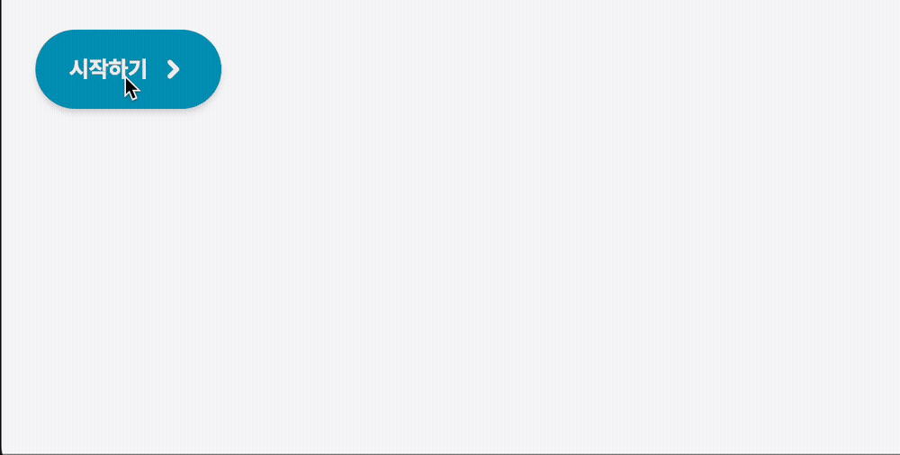
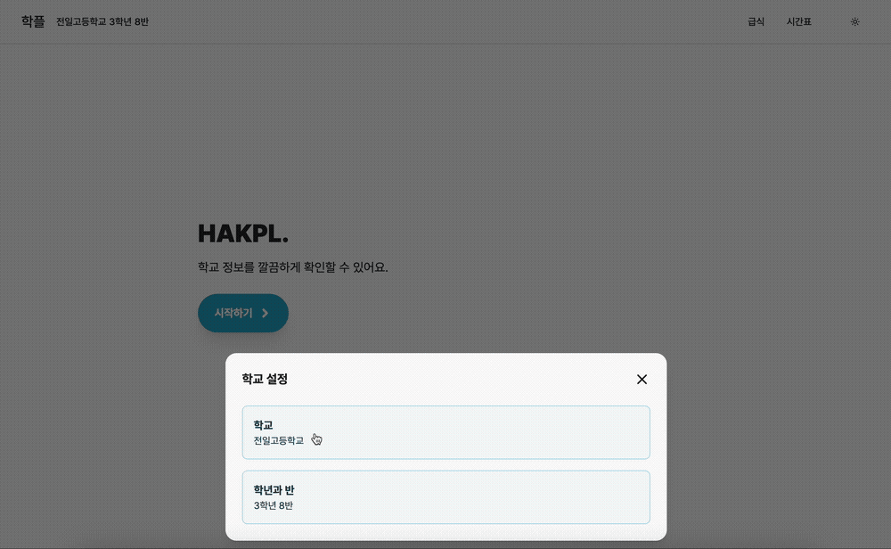

> [!warning] 주의
>
> 아직 작성 중인 글이에요

## 자연스러운 전환 효과 구현

이번 프로젝트의 주요 목표 중 하나가 바로 자연스러운 애니메이션 구현이었다. `framer-motion`을 활용해본 적은 있지만, 더 본격적으로 활용해보고 싶었다. 많은 영감을 준 것이 바로 [Emil Kowalski](https://emilkowal.ski) 님의 결과물들이었다.

먼저, Emil Kowalski 님의 [vaul](https://vaul.emilkowal.ski/) 라이브러리를 활용해보았다. 마치 모바일 네이티브 같은 드로어를 리액트 상에서 구현한 멋진 라이브러리다. 학교를 설정하는 부분에 적용하였는데, 다음과 같이 학교 설정을 위한 메뉴를 튀어나오도록 했다.



여기까진 그냥 라이브러리만 활용한 수준이었다. 문제는 그 다음이었다. 학교 설정을 위해 학교를 검색하고 선택할 수 있는 페이지로 자연스럽게 트랜지션이 발생했음 좋겠다는 생각에 이리저리 연구해보았다.

일단, 처음엔 framer motion에서 `layout` 애트리뷰트를 사용해 구현할 수 있을 거라 생각했다. 하지만 약간의 문제가 있었는데, 바로 라우팅이 일어나는 시점이었다.

드로어 창(모달)이 확대되며 다음 페이지로 연결되려면, 완전히 트랜지션이 끝날 때까지 뒷배경도 유지되어야 했다. 하지만 그냥 단순히 라우팅을 작동시키면 뒷배경은 바로 사라지게 되어 트랜지션이 상당히 부자연스러워진다.

그렇다면 어떻게 해결할 수 있을까? 나는 다음 두 가지의 가능성을 생각해보았다.

1. 기존 페이지에서 (가짜) 화면으로 확장한 뒤 라우팅을 요청한다.
2. 새로운 페이지에도 (가짜로) 뒷배경을 만들어준다.

두 가지를 모두 구현해보았고, 2번 방법의 경우 새로운 페이지가 즉시 라우팅된다는 점에서는 더 나은 부분이 있었지만, 아무래도 뒷배경이 상당히 부자연스러워진다는 점이 큰 단점이었다. 뒷배경을 완벽히 흉내낼 수 없기 때문이었다.

1번 방법은 라우팅이 늦게 이뤄지기 때문에 처음에 흰 화면 상태로 나타난다는 단점이 존재했지만, 그래도 훨씬 자연스러워 보였다. 그래서 1번 방법으로 구현했고, 아래와 같은 결과물을 얻을 수 있었다!



## Cookie? LocalStorage?

학교와 학급 설정을 어디에 보관해야 할까? 서버 컴포넌트를 십분 활용하려면 cookie가 유리하고, 클라이언트에서 다루기엔 localStorage가 유리하다. 처음엔 두 저장소에 모두 유지했다. 클라이언트에선 LocalStorage API를 직접 사용한 건 아니고 Zustand persist를 통해 구현했다.

하지만, 두 저장소에 겹치는 데이터를 유지하는 게 맞을까? 하는 의문이 들었다. 개인적인 생각으로 LocalStorage에 유지하는 게 더 맞는 것 같아 보이긴 했다. 하지만 이런 경우 서버 컴포넌트를 활용하는 게 사실상 어려워진다. 애초에 요청하는 데 학교와 학급 정보가 필요하기 때문에, 클라이언트에서 이 정보를 불러오고 서버 측에 요청해야 하기 때문이다. SSR을 십분 활용하기 위해서는 서버 측에서 학교 정보를 접근할 수 있어야 했다. cookie에 저장하거나, 아니면 search params으로 포함하는 방법이 가능할 것이다.

### 다른 곳에선 어떻게 처리할까

오랜 고민과 함께 다른 곳들은 어떻게 처리하는지 찾아보았다. SSR을 어느 정도 포기하면서 로컬에만 저장하고 AJAX 방식을 사용하는 게 더 흔해보이긴 했다. 하지만 동시에 Next.js 13 이후의 App Router를 사용하는 경우의 예제나 프로젝트를 대상으로 찾아보았을 땐 cookie를 활용하는 경우가 더 잦았다. 애초에 큰 데이터는 아니기 때문에 쿠키를 활용하는 게 더 합리적이지 않을까 싶기도 했다.

그래도 클라이언트에서 학교 정보가 필요한 경우가 있는데, 이런 경우는 어떻게 해야 할까? 이 부분에 대해선 NextAuth와 같은 프로젝트를 많이 참고했다. 개략적으로 정리해보면 기본적으로 쿠키에 저장하고 Context API를 통해 클라이언트 컴포넌트들에 전달해주는 방식이었다.

나도 그런 방식을 채택해 적용해보았고, 꽤나 매끄러웠다 :)

### Cookie에 저장하자!

아래와 같은 helper 함수를 작성해줬고,

````tsx
export async function setSchoolSession(values: SchoolSession) {
  cookies().set("school", encodeURIComponent(`${values.regionCode}.${values.code}.${values.name}`), {
    httpOnly: true,
    path: "/",
  });
  cookies().delete("class");
}```

아래와 같은 context provider와 hook을 작성해 클라이언트에서도 접근할 수 있도록 하였다.

```tsx
"use client";

// Context Provider

export function SchoolSessionProvider({
  children,
  schoolSession,
  classSession,
}) {
  const [schoolClient, setSchoolClient] = useState(schoolSession);
  const [classClient, setClassClient] = useState(classSession);

  useEffect(() => {
    setSchoolClient(schoolSession);
    setClassClient(classSession);
  }, [schoolSession, classSession]);

  return (
    <SchoolClassContext.Provider value={{ school: schoolClient, class: classClient }}>
      {children}
    </SchoolClassContext.Provider>
  );
}

// Hook

export function useSchoolSession() {
  const context = useContext(SchoolClassContext);
  if (!context) throw "Provider 설정되지 않음";

  return context.school;
}
````
